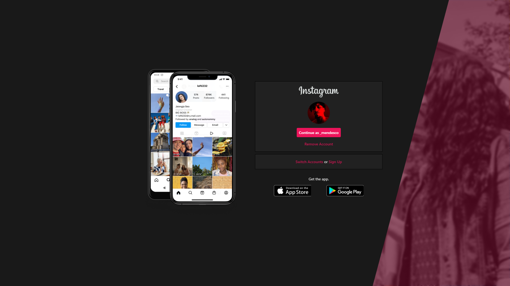
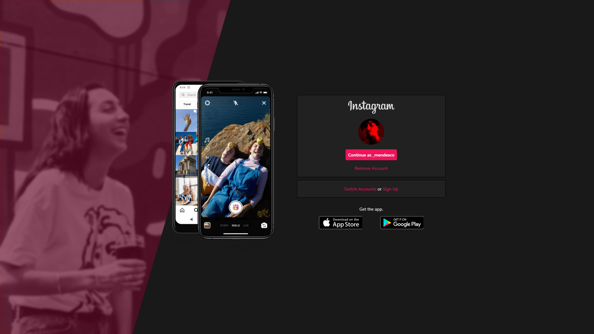

# **Instagram Home**

>`Project for basic HTML and CSS training with responsiveness, with the aim of simulating the official Instagram WEB page!`
>
>#
>
>>To start application, just run open **index.html**
>
> 
#
**
<u>4 hours development</u>
**

  
  
  ##

  

 

#
## 
>
Technologies

  
  
  

 

#

   

 
   

